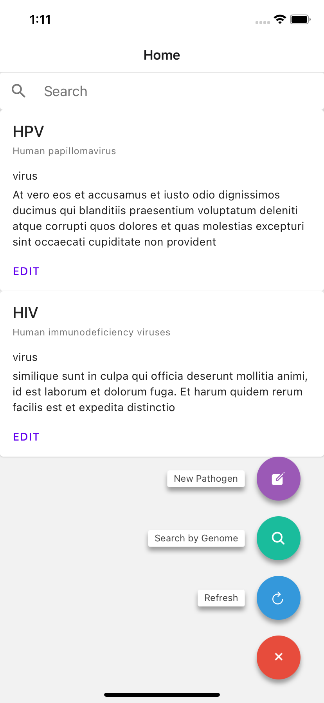
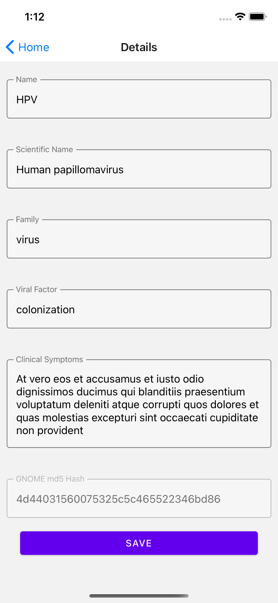

# React-native and React sandbox
Frontend only. Backend mocked.

Implemented a pathogen libray app for both mobile and website using react. 

* Points of consideration are desribed in the [Features](#features) section
* Additional questions can be found in the [questionnaire.md](./questionnaire.md) file
* Database schema at [db-schema.md](./db-schema.md) file

## Screenshots

    
    

## Features
| Features      | Mobile (android+ios) | Website | Notes
| ----------- | ----------- | ----------- | ----------- |
| List pathogens      | ✅       | ✅       |
| Create/update a pathogen   | ✅       | ✅       |
| Search by name   | ✅       | ✅       |
| Search by gnome   | ❌      |  ❌      | TODO:  1. Upload a gnome file to calculate a MD5 hash  2. Then query exiting pathogens with same hash value
| Search result pagination   | ❌      |  ❌      | TODO:  page number placeholder http parameter has been added 
| Add tag   | ❌      |  ❌      |
| Upload gnome file   | ❌      |  ✅      | MD5 hash is generated
| Responsive UI   | ✅      |  ✅      | For mobile tablet device:  Rotate tablet to landscape mode to see the change   For web app: Change browser size to see the change
| Deeplink   | ❌      |  ❌      |
| Material UI design language      | ✅       | ✅       | Architecture item
| Input field validation      | ✅       | ✅       | Architecture item  Keywords:  `updateFieldError`, `DetailFieldValidator.js`
| Internationalization      | ✅       | ✅       | Architecture item  Keywords:  `<I18nStore.I18nProvider>`, `currentDictionary`
| Unified error handling      | ✅       | ✅       | Architecture item  Keywords:  `<Snackbar>`, `[showError, setShowError]`, `[errorMsg, setErrorMsg]`
| Unified progress indicator      | ✅       | ✅       | Architecture item  Keywords:  `[busy, setBusy]`, `pointerEvents`
| Share code between react native and react apps      | ✅      | ✅      | Architecture item  Created common library   Keywords:  `common-lib`
| Local cache      | ❌      | ❌      | Architecture item  TODO:  Need to work with backend to take advatange of HTTP code 304 for cache management
| Runtime exception report      | ❌      | ❌      | Architecture item  TODO:  Integration solutions such as sentry.io or logRocket.com
| Unit test   | ✅      |  ✅      | Architecture item  1. Separate UI view tests from business logic tests  2. Test driven developmnent   3. Produce test coverage report.    Keywords: `jest --collect-coverage`
| Analytics, A/B testing   | ❌      |  ❌      | Architecture item TODO:  Intgretion with Google Analytics or Firebase.
| CI   | ❌      |  ❌      | TODO:  1. Integration with SonarQube   2. Integration with Fastlane for app automation   3. Integration BrowserStack for end-2-end test

## Build and Run
| app      | build | run | note
| ----------- | ----------- | ----------- | ----------- |
| Website      | `yarn install`    | `yarn run`     | Source code under website folder
| iOS      | `yarn install` `npx pod-install ios`   `npx react-native link react-native-vector-icons` `npx react-native link react-native-device-info`  `npx react-native start`  | `npx react-native run-ios`     | Source code under mobile folder
| Android      | `yarn install` `npx react-native start`    | `npx react-native run-android`     | Source code under mobile folder
